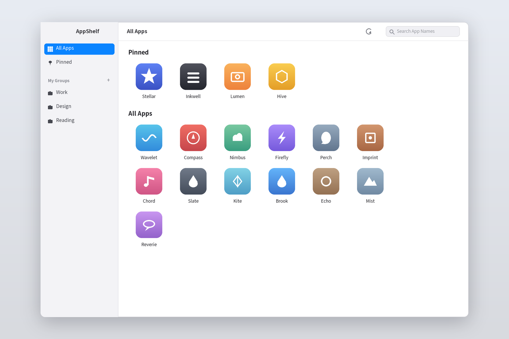

[中文](README.md) | **English**

# AppShelf

Since Launchpad was removed from macOS, browsing applications has become frustrating: the four-finger pinch now opens "Apps", which can't be customized, reordered, or grouped.
So I built a handy app shelf for Mac: pin your favorites, organize them your way, and find anything with a quick search.

AppShelf is a macOS application launcher. It scans the applications on your system and presents them in a clean grid — one click to open. It's made for people who have lots of apps and are tired of digging through the "Apps" panel.

[Download](https://github.com/martinshd/AppShelf/releases) · [使用说明（中文）](docs/usage.md) · [Report an Issue](https://github.com/martinshd/AppShelf/issues)

## What it does

- **All apps in one grid**: automatically scans system application folders and lays everything out by name.
- **Pin your favorites**: right-click to pin apps in a fixed section above the grid; drag to reorder; pins persist across restarts.
- **Custom groups**: create groups your way — Work, Design, Development — and add apps from their right-click menu.
- **Name-only search**: the search field matches application names only, with no files or other noise.
- **Global hotkey**: `Option + Space` shows or hides AppShelf from anywhere.
- **Show in Finder**: locate an app's install location from its right-click menu.

The interface follows your system language (Chinese and English are supported). No menu bar clutter, no Dock icon requirements — just hide it when you're done.

## Getting started

The first release requires an **Apple silicon Mac with macOS 14 or later**. An Intel build is not available yet.

**This is a free preview build that is not notarized by Apple** — you may see a developer verification prompt on first launch. See the notes in each release for installation steps.

1. Download the installer from Releases and follow the notes for that version.
2. Open AppShelf; your application list loads automatically.
3. Right-click an app to pin it, add it to a group, or show it in Finder.
4. Press `Option + Space` to show or hide the window anytime.

## Free, and what comes next

The current version is free to use. There is no pricing or paid plan decided yet.

This repository is for product information, releases, and issue tracking. **The source code is not public at this time.**

## Feedback

If you run into problems or have suggestions, please open an [Issue](https://github.com/martinshd/AppShelf/issues) with your macOS version, AppShelf version, and steps to reproduce.

I'd also love to hear: in what situations do you struggle to find an app, and which part of AppShelf feels awkward? Please redact any personal or work-sensitive information before attaching screenshots.

Developed by [shendi](https://github.com/martinshd).
